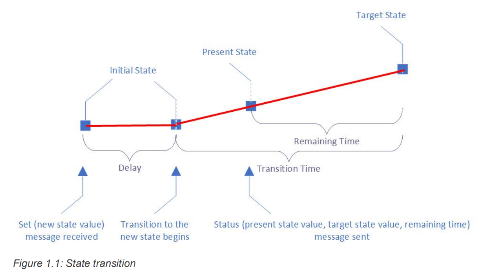
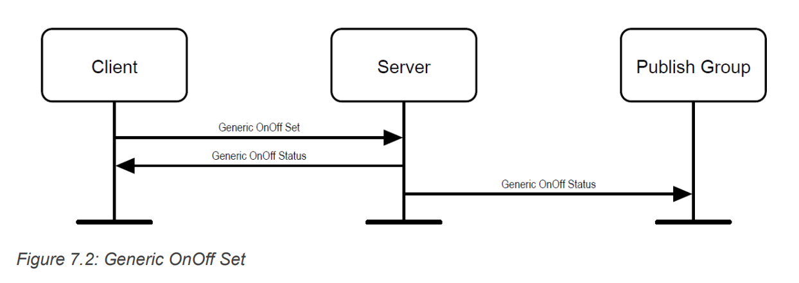
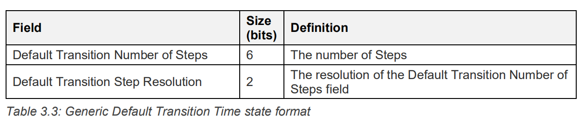
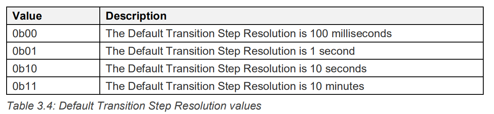
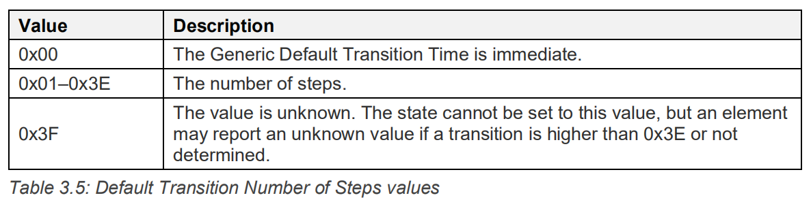

# Generic On Off Model Server

## 接口使用

用 `mesh_generic_on_off_server_get_operations()` 函数获取 model 里的操作集合，包含 message 的 opcode 和相应的处理函数。

`mesh_generic_on_off_server_register_packet_handler()` 函数用于注册一个函数，当 Client 设置 state 时会回调该函数，用于我们进行硬件上的实际改变。回调函数里产生的事件为：

```C
HCI_EVENT_MESH_META - MESH_SUBEVENT_STATE_UPDATE_BOOL

/**
 * @format 114411
 * @param subevent_code
 * @param element_index
 * @param model_identifier
 * @param state_identifier
 * @param reason
 * @param value
 */
#define MESH_SUBEVENT_STATE_UPDATE_BOOL          0x24
```

由于 OnOff 是一个二进制变量，因此产生一个 bool 类型的 subevent ，其 `reason` 参数有多个，标识不同时刻：



参考上述 State transition 图：

- `MODEL_STATE_UPDATE_REASON_SET` - 代表 delay 和 transition time 都为 0，state 直接改变。
- `MODEL_STATE_UPDATE_REASON_TRANSITION_START` - 代表 delay 结束的时刻。
- `MODEL_STATE_UPDATE_REASON_TRANSITION_ACTIVE` - 代表 transition time 中，会多次触发。
- `MODEL_STATE_UPDATE_REASON_TRANSITION_END` - 代表 state transition 结束。

就目前应用来说，常用的就是 `MODEL_STATE_UPDATE_REASON_SET` 。

`mesh_generic_on_off_server_get()` 函数用于获取 state 的值，`mesh_generic_on_off_server_set()` 函数用于设置 state 的值，硬件的实际变化需要在回调函数里处理。`mesh_generic_on_off_server_set_publication_model()` 函数可用于设置 publication model，用于处理 state 改变时的消息发布，如下图：



## 内部实现

此处研究其内部实现是因为需要学习 btstack 如何实现一个 model，为后续的 vendor model 做铺垫。

### state

generic model 里的 state 都定义在 mesh_generic_model.h 文件里，根据 btstack 目前的实现，有 `mesh_generic_on_off_state_t` 表示 onoff state，`mesh_generic_level_state_t` 表示 level state 。

以 onoff state 为例，其定义如下：

```C
typedef struct mesh_transition {
    btstack_timer_source_t timer;

    mesh_transition_state_t state;

    uint8_t  transaction_identifier; 
    uint32_t transaction_timestamp_ms;
    uint16_t src_address;
    uint16_t dst_address; 

    uint8_t num_steps;
    mesh_default_transition_step_resolution_t step_resolution;
    uint32_t step_duration_ms;

    // to send events and/or publish changes
    mesh_model_t * mesh_model;
        
    // to execute transition
    void (* transition_callback)(struct mesh_transition * transition, model_state_update_reason_t event);
} mesh_transition_t;

typedef struct {
    mesh_transition_t base_transition;

    uint8_t  current_value;
    uint8_t  target_value;
} mesh_transition_bool_t;

typedef struct {
    mesh_transition_bool_t transition_data;          
} mesh_generic_on_off_state_t;
```

从下往上看，onoff state 里有一个 `mesh_transition_bool_t` 类型的变量，标识该 state 是一个类似 bool 类型，只有 0 和 1 的值。

`mesh_transition_bool_t` 类型内部有一个 `current_value` 和 `target_value`，这是因为协议考虑到了有些设备 onoff 改变并不是瞬时的，可能需要一定的延时才能开始改变，而且改变也需要一定的时间，因此对 value 值做了区分，而 `base_transition` 就是用来处理这种改变的。


`base_transition` 在 btstack 里主要用于 access 层内部处理，不过我们也需要从它获取一些相关资源，因此也要多了解一些。

- `num_steps`, `step_resolution`, `step_duration_ms`：这三个值决定了 state transition 的时间，step_resolution 是转换步长的分辨率，是一个 2-bit enum 值，参考下图图2。 num_steps 有 6-bit 可用，是转换步长的数量，而 step_duration_ms 则是转换步长的实际值，以 ms 为单位，例如 1s - 1000 。







- `mesh_model` 是本次 state transition 所属的 model 。
- `transition_callback` 是 state transition 里的事件回调函数，由应用层注册，具体的事件有：

```C
typedef enum {
    MODEL_STATE_UPDATE_REASON_SET = 0x00u, 
    MODEL_STATE_UPDATE_REASON_TRANSITION_START, 
    MODEL_STATE_UPDATE_REASON_TRANSITION_ACTIVE,
    MODEL_STATE_UPDATE_REASON_TRANSITION_END, 
    MODEL_STATE_UPDATE_REASON_TRANSITION_ABORT, 
    MODEL_STATE_UPDATE_REASON_APPLICATION_CHANGE
 } model_state_update_reason_t;
```

大部分含义都在**接口使用**章节解释了。

- `timer` - access 内部使用的定时模块。
- `state` - access 内部使用的状态机。
- `src_address`, `dst_address` - mesh 里发送 state transition 往往意味着有 client 在设置 server 里的 state，因此 src_address 就是指 message 的源地址，dst_address 是指 message 的目的地址。
- `transaction_identifier` - 也叫 TID，包含在 message 内部，用于去重。
- `transaction_timestamp_ms` - 开始转换的时间戳。

`base_transition` 变量的另一个用于是类似 OOB 的多态的思想，

```C
typedef struct {
    mesh_transition_t base_transition;

    uint8_t  current_value;
    uint8_t  target_value;
} mesh_transition_bool_t;
```

access 内部使用 `base_transition` 变量，然后回调上层注册函数时，也是传递该变量指针，但是由于它是 `mesh_transition_bool_t` 类型变量的第一个成员，我们可以使用 `(mesh_transition_bool_t *)` 强制将该变量转换成 `mesh_transition_bool_t` 类型来使用。

TODO：对于不需要 state transition 的 state，有待研究。

### message


