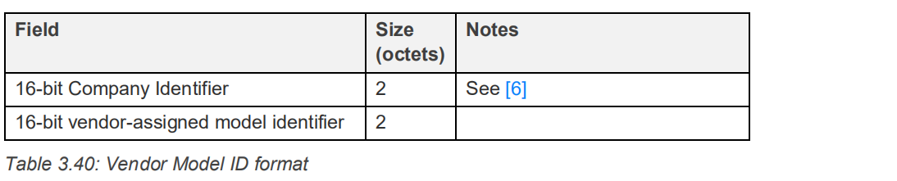

# Generic On Off Model Server

## 接口使用

用 `mesh_generic_on_off_server_get_operations()` 函数获取 model 里的操作集合，包含 message 的 opcode 和相应的处理函数。

`mesh_generic_on_off_server_register_packet_handler()` 函数用于注册一个函数，当 Client 设置 state 时会回调该函数，用于我们进行硬件上的实际改变。回调函数里产生的事件为：

```C
HCI_EVENT_MESH_META - MESH_SUBEVENT_STATE_UPDATE_BOOL

/**
 * @format 114411
 * @param subevent_code
 * @param element_index
 * @param model_identifier
 * @param state_identifier
 * @param reason
 * @param value
 */
#define MESH_SUBEVENT_STATE_UPDATE_BOOL          0x24
```

由于 OnOff 是一个二进制变量，因此产生一个 bool 类型的 subevent ，其 `reason` 参数有多个，标识不同时刻：


参考上述 State transition 图：

- `MODEL_STATE_UPDATE_REASON_SET` - 代表 delay 和 transition time 都为 0，state 直接改变。
- `MODEL_STATE_UPDATE_REASON_TRANSITION_START` - 代表 delay 结束的时刻。
- `MODEL_STATE_UPDATE_REASON_TRANSITION_ACTIVE` - 代表 transition time 中，会多次触发。
- `MODEL_STATE_UPDATE_REASON_TRANSITION_END` - 代表 state transition 结束。

就目前应用来说，常用的就是 `MODEL_STATE_UPDATE_REASON_SET` 。

`mesh_generic_on_off_server_get()` 函数用于获取 state 的值，`mesh_generic_on_off_server_set()` 函数用于设置 state 的值，硬件的实际变化需要在回调函数里处理。`mesh_generic_on_off_server_set_publication_model()` 函数可用于设置 publication model，用于处理 state 改变时的消息发布，如下图：


## 内部实现

此处研究其内部实现是因为需要学习 btstack 如何实现一个 model，为后续的 vendor model 做铺垫。

### state

generic model 里的 state 都定义在 mesh_generic_model.h 文件里，根据 btstack 目前的实现，有 `mesh_generic_on_off_state_t` 表示 onoff state，`mesh_generic_level_state_t` 表示 level state 。

以 onoff state 为例，其定义如下：

```C
typedef struct mesh_transition {
    btstack_timer_source_t timer;

    mesh_transition_state_t state;

    uint8_t  transaction_identifier; 
    uint32_t transaction_timestamp_ms;
    uint16_t src_address;
    uint16_t dst_address; 

    uint8_t num_steps;
    mesh_default_transition_step_resolution_t step_resolution;
    uint32_t step_duration_ms;

    // to send events and/or publish changes
    mesh_model_t * mesh_model;
        
    // to execute transition
    void (* transition_callback)(struct mesh_transition * transition, model_state_update_reason_t event);
} mesh_transition_t;

typedef struct {
    mesh_transition_t base_transition;

    uint8_t  current_value;
    uint8_t  target_value;
} mesh_transition_bool_t;

typedef struct {
    mesh_transition_bool_t transition_data;          
} mesh_generic_on_off_state_t;
```

从下往上看，onoff state 里有一个 `mesh_transition_bool_t` 类型的变量，标识该 state 是一个类似 bool 类型，只有 0 和 1 的值。

`mesh_transition_bool_t` 类型内部有一个 `current_value` 和 `target_value`，这是因为协议考虑到了有些设备 onoff 改变并不是瞬时的，可能需要一定的延时才能开始改变，而且改变也需要一定的时间，因此对 value 值做了区分，而 `base_transition` 就是用来处理这种改变的。


`base_transition` 在 btstack 里主要用于 access 层内部处理，不过我们也需要从它获取一些相关资源，因此也要多了解一些。

- `num_steps`, `step_resolution`, `step_duration_ms`：这三个值决定了 state transition 的时间，step_resolution 是转换步长的分辨率，是一个 2-bit enum 值，参考下图图2。 num_steps 有 6-bit 可用，是转换步长的数量，而 step_duration_ms 则是转换步长的实际值，以 ms 为单位，例如 1s - 1000 。


- `mesh_model` 是本次 state transition 所属的 model 。
- `transition_callback` 是 state transition 里的事件回调函数，由应用层注册，具体的事件有：

```C
typedef enum {
    MODEL_STATE_UPDATE_REASON_SET = 0x00u, 
    MODEL_STATE_UPDATE_REASON_TRANSITION_START, 
    MODEL_STATE_UPDATE_REASON_TRANSITION_ACTIVE,
    MODEL_STATE_UPDATE_REASON_TRANSITION_END, 
    MODEL_STATE_UPDATE_REASON_TRANSITION_ABORT, 
    MODEL_STATE_UPDATE_REASON_APPLICATION_CHANGE
 } model_state_update_reason_t;
```

大部分含义都在**接口使用**章节解释了。

- `timer` - access 内部使用的定时模块。
- `state` - access 内部使用的状态机。
- `src_address`, `dst_address` - mesh 里发送 state transition 往往意味着有 client 在设置 server 里的 state，因此 src_address 就是指 message 的源地址，dst_address 是指 message 的目的地址。
- `transaction_identifier` - 也叫 TID，包含在 message 内部，用于去重。
- `transaction_timestamp_ms` - 开始转换的时间戳。

`base_transition` 变量的另一个用于是类似 OOB 的多态的思想，

```C
typedef struct {
    mesh_transition_t base_transition;

    uint8_t  current_value;
    uint8_t  target_value;
} mesh_transition_bool_t;
```

access 内部使用 `base_transition` 变量，然后回调上层注册函数时，也是传递该变量指针，但是由于它是 `mesh_transition_bool_t` 类型变量的第一个成员，我们可以使用 `(mesh_transition_bool_t *)` 强制将该变量转换成 `mesh_transition_bool_t` 类型来使用。

TODO：对于不需要 state transition 的 state，有待研究。

### message

Spec 定义了 4 条操作 onoff state 的消息，而 Server 端需要接收其中的三条消息，如下图：


在 btstack 中，这一切都实现在 `mesh_generic_on_off_model_operations[]` 这个结构体数组里，**该数组必须以 NULL 结束**。

```C
// Generic On Off Message
const static mesh_operation_t mesh_generic_on_off_model_operations[] = {
    { MESH_GENERIC_ON_OFF_GET,                                  				 0, 		generic_on_off_get_handler },
    { MESH_GENERIC_ON_OFF_SET,                                   				 2, 		 generic_on_off_set_handler },
    { MESH_GENERIC_ON_OFF_SET_UNACKNOWLEDGED,      2,		   generic_on_off_set_unacknowledged_handler },
    { 0, 0, NULL }
};
```

该结构体是 opcode 和相应处理函数的结合：

```C
// function to handle model operation message
typedef void (*mesh_operation_handler)(struct mesh_model * mesh_model, mesh_pdu_t * pdu);

typedef struct {
    uint32_t opcode;
    uint16_t minimum_length;
    mesh_operation_handler handler;
} mesh_operation_t;
```

### model

btstack 里 model 结构体包含下述成员：

```C
typedef struct mesh_model {
    // linked list item
    btstack_linked_item_t item;
    // element
    struct mesh_element * element;
    // internal model enumeration
    uint16_t mid;
    // vendor_id << 16 | model id, use BLUETOOTH_COMPANY_ID_BLUETOOTH_SIG_INC for SIG models
    uint32_t model_identifier;
    // model operations
    const mesh_operation_t * operations;
    // publication model if supported
    mesh_publication_model_t * publication_model;
    // data
    void * model_data;
    // bound appkeys
    uint16_t appkey_indices[MAX_NR_MESH_APPKEYS_PER_MODEL];
    // subscription list
    uint16_t subscriptions[MAX_NR_MESH_SUBSCRIPTION_PER_MODEL];
    // packet handler for transition events in server, event callback handler in client
    btstack_packet_handler_t model_packet_handler;
} mesh_model_t;
```

这里面的 `model_data` ，`operations` 就是我们之前解释的 state 和 message 处理结构体数组。

- `model_identifier` -  一个 32 bits 的变量，用于表示该 model 的标识符

每一个 model 都有一个标识符（Model identifier），可以是 SIG 联盟定义的 16 bits 标识符，也可以是厂商自定义的 32 bits Vendor Model 标识符，其格式如下图。SIG 联盟定义的一系列标准的 model，其标识符可以在 **MshMDL v1.0.1 - 7 Summary - 7.3 Models summary** 里找到。



- `item` 是链表节点。
- `mid` 是内部使用的 enum 值。
- `publication_model` 是该 model 支持的 publication 功能。
- `appkey_indices` - AppKeys 列表。
- `subscriptions` - model 订阅列表。

上述的这些成员其实在 Mesh Spec 的 **4 Foundation models - 4.2 State Definitions** 里有介绍。

### 数据收发

在 mesh_generic_on_off_server.c 文件里搜索 `mesh_upper` ，就能够找到所有数据收发相关的内容了。

**发送数据：**

onoff server 当收到 set acknowledge 或 get 消息后会返回 status 消息，这个时候 server 就需要主动发送数据了。

```C
// message builder using template
mesh_upper_transport_pdu_t * mesh_access_setup_message(const mesh_access_message_t *message_template, ...);
```

`mesh_access_setup_message()` 函数用于构建一个 upper transport pdu ，函数参数数量可变，根据 `message_template` 传入不同数量的参数用于构建 message 。

以 onoff status 为例，它有两种格式，一种是 1 字节的，另一种是 3 字节的，参考下图：


而 btstack 里则对应与瞬时的（instantaneous）或过渡的（transition），如下述代码：

```C
const mesh_access_message_t mesh_generic_on_off_status_transition = {
        MESH_GENERIC_ON_OFF_STATUS, "111"
};
const mesh_access_message_t mesh_generic_on_off_status_instantaneous = {
        MESH_GENERIC_ON_OFF_STATUS, "1"
};
```

`MESH_GENERIC_ON_OFF_STATUS` 代表 onoff status message 的 opcode，后面的 "111" 和 "1" 则代表消息数据的 format，

- '1' - 1 byte
- '2' - 2 byte
- '3' - 3 byte
- '4' - 4 byte
- 'm' - model identifier

因此使用 `mesh_generic_on_off_status_transition` 格式构建 message 时，需要传入 current_value, target_vaule 和 remaining_time 这三个值，如下代码：

```C
mesh_access_setup_message(&mesh_generic_on_off_status_transition, state->transition_data.current_value, state->transition_data.target_value, remaining_time);
```

上述的代码在 upper transport pdu 里添加了一条 model message，或者说是 access pdu，现在还需要用 `mesh_upper_transport_setup_access_pdu_header()` 函数构建 access pdu header，然后就可以用 `mesh_access_send_unacknowledged_pdu()` 发送 pdu 了。

```C
uint8_t mesh_upper_transport_setup_access_pdu_header(mesh_pdu_t * pdu, uint16_t netkey_index, uint16_t appkey_index, uint8_t ttl, uint16_t src, uint16_t dest, uint8_t szmic);
```

**接收数据：**

接收数据主要涉及解析 pdu，btstack 里提供了 `mesh_access_parser_*()` 来解析 access message， 先调用 `mesh_access_parser_init()` 初始化解析器，然后就可以依次调用 `mesh_access_parser_get_*()` 函数从解析器里获取数据了，例如 uint8_t, uint32_t, key, model_identifier 等等，利用 `mesh_access_parser_available()` 判断解析器里是否有多余的数据。

消息处理完毕后需要调用 `mesh_access_message_processed()` 通知 access 层这个 access message 已经被更高层处理了。

state transition 完成后，需要调用 `mesh_access_emit_state_update_*()` 系列函数通知用于发送了相应的事件，用户需要在相应事件里处理实际的硬件变化。

