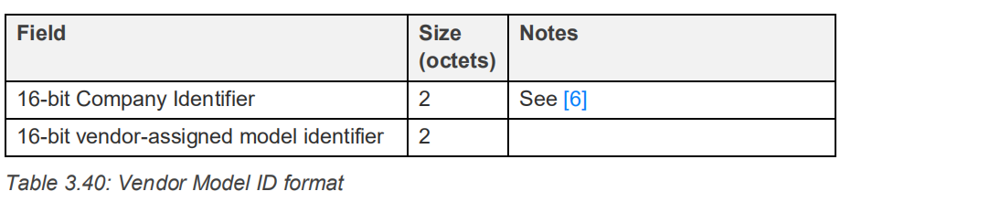
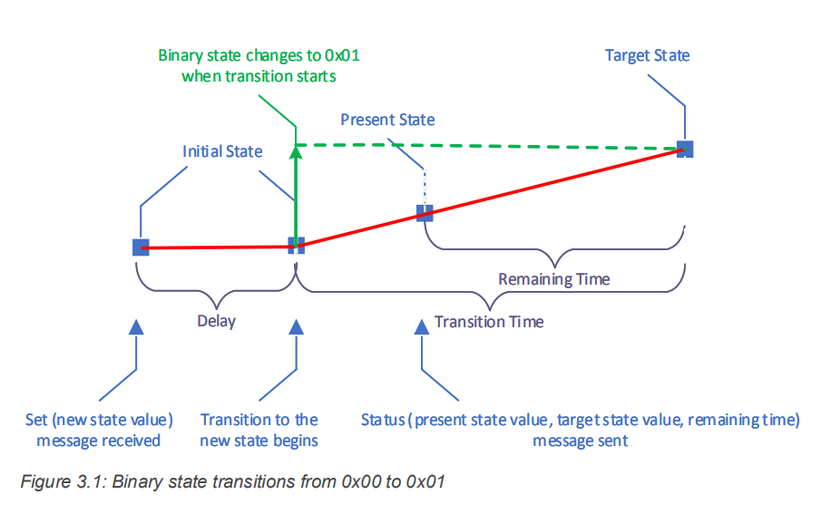

从 Unprovisioned Device 角度考虑

在入网前需要发送 Unprovisioned Device beacon，其中有 UUID 和 OOB Information 需要我们设置，`beacon_unprovisioned_device_start()` 函数就是用于设置这两个参数并启动 beacon，但 mesh 协议栈内部集成了该函数，因此我们最好不要使用。我们需要使用 `mesh_node_set_device_uuid()` 函数设置 UUID，目前默认的为 OOB Information 为 0，不提供任何的 OOB Information ，且没有提供接口修改它。

为了能够接收到 Provisioner 的信息，还需要开启 Device 的扫描功能，使用 `gap_set_scan_params()` 设置扫描参数，用 `gap_start_scan()` 开启扫描。

之后就等待进行 Provisioning 流程，用 `mesh_register_provisioning_device_packet_handler()` 函数注册一个 Device Provisioning 过程中的回调函数，用于处理相应的事件（Link Open, Link Close, Attention Timer 等），这些事件可以在 btstack_defines.h 文件里找到，前缀为 `MESH_SUBEVENT_PB_*` 。

在 Provisioning 阶段 Deivce 端需要进行的交互的数据（例如 Public Key OOB，Static OOB，Output OOB action 等），都可以使用 provisioning_device.h 里的接口设置，例如用 `provisioning_device_set_static_oob()` 设置 Static OOB 值。

进入 Configuration 阶段后，Provisioner 的相关操作会产生 `MESH_SUBEVENT_CONFGURATION_*` 系列事件，我们根据需要使用。

可以通过 `mesh_element_add_model()` 函数给一个 element 添加一个 model 。


Generic OnOff Model

每一个 model 都有一个标识符（Model identifier），可以是 SIG 联盟定义的 16 bits 标识符，也可以是厂商自定义的 32 bits Vendor Model 标识符，其格式如下图。SIG 联盟定义的一系列标准的 model，其标识符可以在 **MshMDL v1.0.1 - 7 Summary - 7.3 Models summary** 里找到。



btstack 里用 `mesh_model_t` 这个结构体代表一个 model 。

```C
typedef struct mesh_model {
    // linked list item
    btstack_linked_item_t item;
    // element
    struct mesh_element * element;
    // internal model enumeration
    uint16_t mid;
    // vendor_id << 16 | model id, use BLUETOOTH_COMPANY_ID_BLUETOOTH_SIG_INC for SIG models
    uint32_t model_identifier;
    // model operations
    const mesh_operation_t * operations;
    // publication model if supported
    mesh_publication_model_t * publication_model;
    // data
    void * model_data;
    // bound appkeys
    uint16_t appkey_indices[MAX_NR_MESH_APPKEYS_PER_MODEL];
    // subscription list
    uint16_t subscriptions[MAX_NR_MESH_SUBSCRIPTION_PER_MODEL];
    // packet handler for transition events in server, event callback handler in client
    btstack_packet_handler_t model_packet_handler;
} mesh_model_t;
```

其内部的 `model_identifier` 成员是一个 32 bits 的变量，用于表示该 model 的标识符。

(?????) `model_data` 是一个 void * 指针，用于指向该 model 拥有的 state，例如 Generic OnOff Model 中，model_data 指向一个 `mesh_generic_on_off_state_t` 结构体变量。

`operations` 指向一个 `mesh_operation_t` 类型的结构体数组，

```C
typedef struct {
    uint32_t opcode;
    uint16_t minimum_length;
    mesh_operation_handler handler;
} mesh_operation_t;
```

操作里的 `opcode` 代表操作的 opcode，可以用 SIG 联盟的标准 opcode，也可以厂商自定义，`minimum_length` 指定消息的最小长度，用于支持消息的可选字段，`handler` 指定消息的处理函数。下述给出 Generic OnOff Model 定义的 operation 数组，该数组必须以 `{0, 0, NULL}` 结尾。

```C
// Generic On Off Message
const static mesh_operation_t mesh_generic_on_off_model_operations[] = {
    { MESH_GENERIC_ON_OFF_GET,                                   0, generic_on_off_get_handler },
    { MESH_GENERIC_ON_OFF_SET,                                   2, generic_on_off_set_handler },
    { MESH_GENERIC_ON_OFF_SET_UNACKNOWLEDGED,                    2, generic_on_off_set_unacknowledged_handler },
    { 0, 0, NULL }
};
```

`model_packet_handler` 成员是一个函数指针，当 Model Client 对 Model Server 进行相关操作时调用该函数。

`mesh_generic_on_off_server_set()` 函数用于更改 state，`mesh_generic_on_off_server_get()` 函数用于获取 state 。


state


```C
typedef struct {
    mesh_transition_t base_transition;

    uint8_t  current_value;
    uint8_t  target_value;
} mesh_transition_bool_t;

typedef struct {
    mesh_transition_bool_t transition_data;          
} mesh_generic_on_off_state_t;
```

state 转换 delay 结束后，生成 `MODEL_STATE_UPDATE_REASON_TRANSITION_START` 事件，在转换中每一段时间生成 `MODEL_STATE_UPDATE_REASON_TRANSITION_ACTIVE` 事件，转换结束后生成 `MODEL_STATE_UPDATE_REASON_TRANSITION_END` 事件。




```C
typedef struct {
    uint32_t     opcode;
    const char * format;
} mesh_access_message_t;

const mesh_access_message_t mesh_generic_on_off_status_transition = {
        MESH_GENERIC_ON_OFF_STATUS, "111"
};

const mesh_access_message_t mesh_generic_on_off_status_instantaneous = {
        MESH_GENERIC_ON_OFF_STATUS, "1"
};
```

构造消息 -> 发送消息 -> 通知上层。

```C
mesh_access_send_unacknowledged_pdu();
mesh_access_send_acknowledged_pdu();
```


model


element


node


Unprovisioned Device Beacon 相关

通过 `mesh_node_set_device_uuid()` 设置 Unprovisioned Device Beacon 里的 UUID 值，该函数内部有 buffer 缓冲 UUID。通过 `mesh_node_get_device_uuid()` 获取 UUID 。