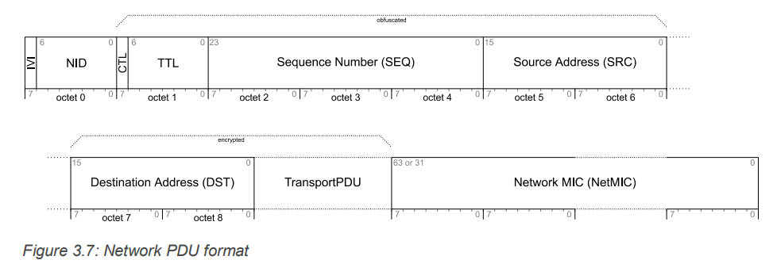
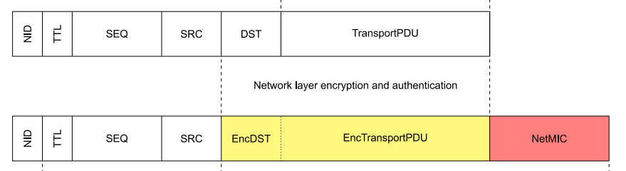
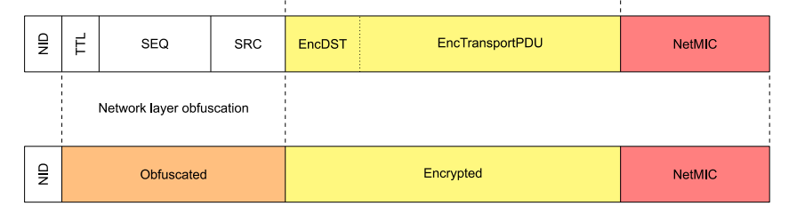
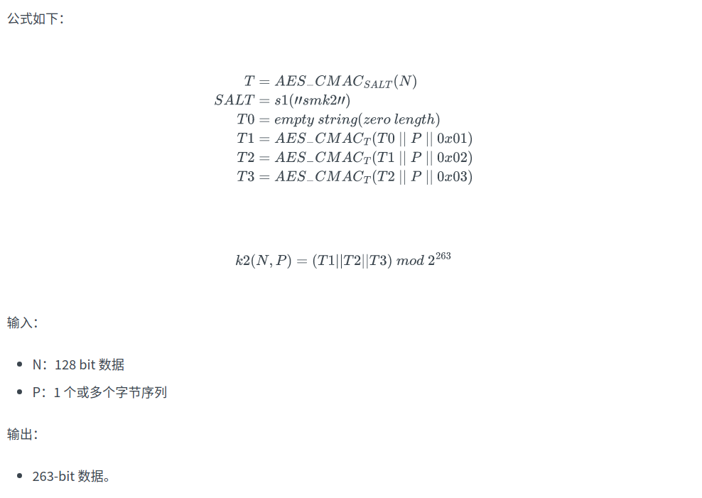

# mesh NID

本篇文章主要讲解 Mesh Network PDU 里 NID 字段的作用，会结合密码学技术和收包流程进行介绍，从而对 NID 字段有一个更加清晰的认识。

先对 NID 的作用做一个整体性的介绍：

**NID 是一个 7-bit 的数据，利用 NID 能够索引到发送方发送 Network PDU 时使用的 NetKey，进而得到加密 Network PDU 使用的 Encryption Key 和混淆 Network PDU 使用的 Privacy PDU，从而成功地解密 Network PDU 。**

NetKey 是 Network Key 的简称，用于 Mesh Network Layer 消息的加密解密，拥有相同 NetKey 的节点认为处于同一子网，能够相互通信。

## **为什么利用 NID 就能够索引到 NetKey 呢？**

这就需要从 NID 的来源说起了，NID 是 NetKey 根据 k2 秘钥派生算法计算的结果，如下图所示：

k2 秘钥算法的结果是一个 263-bit 的数据，从高位到低位依次为 NID（7-bit），Encryption Key（128-bit），Privacy Key （128-bit），感兴趣的话可以参考附录或者 Mesh Spec 1.0.1 。

因此相同的 NetKey 通过 k2 算法计算得到的 NID 总是一致的，但这并**不能完全解释**利用 NID 就能够索引到 NetKey 。因为一个 NetKey 对应一个 NID，但一个 NID 可能对应 $2^{121}$​ 个 NetKey，两者并不是一一对应的。如果一个节点含有多个 NetKey，并且其中有两个 NetKey 计算出来的 NID 相同，那么我们根据 NID 字段就无法区分这两个 NetKey，我们还需要其他的辅助手段。

## Network PDU 加密认证和混淆

Network PDU 里的数据是经过加密（Encryption）、认证（Authentication）和混淆（ Obfuscation）之后才发送出去的。

Mesh Network Layer 通过 AES-CCM 算法利用 **Encryption Key** 加密认证 DST 字段和 TransportPDU 字段，并把消息认证码放在 NetMIC 的位置。如下图所示：

之后 Network Layer 还对 Network Header（CTL, TTL, SEQ, SRC）进行了**混淆**操作，就是利用 **Privacy Key** 将这些字段通过加密函数 e（AES-128）加密，用于防止被动**窃听者**利用这些信息识别节点。

这里的 Encryption Key 和 Privacy Key 也是 NetKey 通过 k2 秘钥衍生算法计算得到的，与 NID 一致。

从上图中我们可以看到，Network PDU 在空中传输的时候，只有 NID 字段是**明文**，可以直接获取，我们需要根据 NID 来解密整个 Network PDU 。

## 解密 Network PDU 整个流程

接收方节点内部可能有多个 NetKey，为了方便，一般会提前将 NetKey 送入 k2 秘钥派生算法，计算出相应的 NID，Encryption Key 和 Privacy Key，并将这些信息储存起来，若下表（仅为示例）所示：

| NID  | Encryption Key                     | Privacy Key                        |
| ---- | ---------------------------------- | ---------------------------------- |
| 0x17 | 0x12345678901234567890123456789012 | 0x56789012345678901234567890123456 |
| 0x17 | 0x34567890123456789012345678901234 | 0x78901234567890123456789012345678 |

当接收方收到 Network PDU 后，会提取里面的明文 NID 字段，然后会遍历上述表，查找自己是否拥有该 NID。

- 如果没有则肯定说明该 Network PDU 无法解密，需要丢弃；
- 如果有我们还需要进一步判断，提取与该 NID 处于同一条目的 Encryption Key，并尝试认证 **Encrypted** 里的消息（也是通过 AES-CCM），并将计算得到的 MIC 值与 Network PDU 里的 NetMIC 比较。
  - 若相同则说明成功根据 NID 字段找到了 Encryption Key ；
  - 若不同则继续遍历上述表，重复之前的步骤。

通过上述流程，我们就成功根据 NID 字段找到了 Encryption Key 和 Privacy Key，又因为这三个字段是 NetKey 通过 k2 算法得到的，因此我们也就找到了 NetKey，成功地解决了上述疑问。

本篇文章对加密认证相关操作介绍的不多，需要读者有一定的密码学基础，或者具有一定抽象的思维。不过本文章还是将 NID 字段的作用讲清楚了，还介绍了协议栈实现的一种方式，希望能有所帮助。

----

## 附录

k2 秘钥派生算法：

