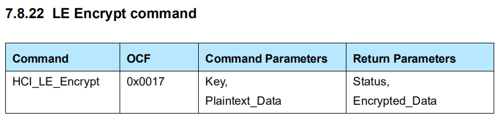

# Mesh Security

## Encryption function

加密函数 $e$​ 使用 AES-128 加密算法（FIPS-197），用于保证消息的**机密性**，公式如下：
$$
ciphertext = e(key, plaintext)
$$
输入：

- key: 128-bit 对称秘钥
- palintext: 128-bit 明文

输出：

- ciphertext: 128-bit 密文

AES-128 可由 Host 软件实现，也可通过 LE Encrypt command 请求 Controller 来加密数据，

## CMAC function

CMAC（Cipher-based Message Authentication Code, RFC4493）是一种基于加密的**消息认证码**，用于保证消息的**完整性**以及**认证**消息。AES-CMAC 内部使用 AES-128 加密算法，**图示**。

公式如下：
$$
MAC = AES_-CMAC_k(m)
$$
输入：

- key: 128-bit 对称秘钥。
- m: 待认证的可变长度的消息。

输出：

- MAC: 128-bit 消息认证码

## CCM function

CCM（Counter with CBC-MAC, RFC3610）是一个同时对消息进行**加密**和**认证**的算法，是 **CTR 加密模式**和 **CMAC 认证算法**的混合，Spec 里使用 AES-128 加密的 AES-CCM，公式如下：
$$
ciphertext, mic = AES_-CCM_k(n, m, a)
$$
输入：

- k：128-bit 对称秘钥
- n：104-bit 随机数
- m：待加密认证的可变长度的消息（明文）
- a：待认证的可变长度的数据，称为额外的数据，若不需要可设长度为 0 。

输入：

- ciphertext：已加密的可变长度的消息
- mic：消息认证码

## s1 SALT generation function

salt（盐）主要用于更改明文的**消息摘要**。对于同一个消息摘要函数，只要知道了明文，就可以计算出相同的消息摘要，而如果在明文里加点盐（将 salt 插入到明文里），那么计算出来的消息摘要就会改变，而且只有同时拥有相同的**明文**和 **salt 值**才能计算出相同的消息摘要。

Mesh Spec 里 s1 SALT 计算公式如下：
$$
s1(M) = AES_-CMAC_{ZERO}(M)
$$
输入：

- M：长度非 0 的字节数组或 ASCII 编码字符串
- ZERO：128-bit 0

输入：

- s1(M)：128-bit salt 值

## k1 derivation function

k1 是网络秘钥衍生函数，用于生成 **IdentityKey** 和 **BeaconKey** 。利用 AES_CMAC 来实现，公式如下：
$$
k1(N, SALT, P) = AES_-CMAC_T(P)
$$

$$
T = AES_-CMAC_{SALT}(N)
$$

输入：

- N：0 个或多个字节序列
- SALT：128-bit 盐值，利用 s1 函数生成
- P：0 个或多个字节序列

## k2 network key material derivation function

k2 秘钥派生函数用于生成 Master 和 Private Low Power 节点通信用的 EncryptionKey，PrivacyKey 和 NID 。

公式如下：
$$
\begin{align}
T &= AES_-CMAC_{SALT} (N) \\
SALT &= s1("smk2") \\
T0 &= empty\ string (zero\ length)	\\
T1 &= AES_-CMAC_T (T0\ ||\ P\ ||\ 0x01)	\\
T2 &= AES_-CMAC_T (T1\ ||\ P\ ||\ 0x02)	\\
T3 &= AES_-CMAC_T (T2\ ||\ P\ ||\ 0x03)	\\
\end{align}
$$

$$
k2(N, P) = (T1 || T2 || T3) \ mod \  2^{263}
$$

输入：

- N：128 bit 数据
- P：1 个或多个字节序列

输出：

- 263-bit 数据。

## k3 derivation function

k3 秘钥派生函数用于从 private key 生成一个 64-bit 的公有值。
$$
\begin{align}
k3(N) &= AES_-CMAC_T\ (\ "id64"\ ||\ 0x01 )\ mod\ 2^{64}	\\
T &= AES_-CMAC_{SALT}\ (N)	\\
SALT &= s1(\ "smk3"\ )	\\
\end{align}
$$
输入：

- 128-bit 数据

输出：

- 64-bit 数据

## k4 derivation function

k4 秘钥派生函数用于从 private key 生成一个 6-bit 的公有值。
$$
\begin{align}
k4(N) &= AES_-CMAC_T\ (\ "id6"\ ||\ 0x01 )\ mod\ 2^{6}	\\
T &= AES_-CMAC_{SALT}\ (N)	\\
SALT &= s1(\ "smk4"\ )	\\
\end{align}
$$
输入：

- 128-bit 数据

输出：

- 6-bit 数据

## Keys

每个 AppKey 需要绑定一个 NetKey，这意味着 AppKey 只能在它绑定的 NetKey 的上下文环境中使用，而 DevKey 需要绑定所有的 NetKey 。
$$
DevKey = k1(ECDHSecret,\ ProvisioningSalt,\ "prdk")
$$
AppKey 利用伪随机数生成器生成。
$$
AID = k4(AppKey)
$$
NetKey 利用伪随机数生成器生成。
$$
NID\ || \ EncryptionKey\ || \ PrivacyKey = k2(NetKey, 0x00)
$$
NID（7-bit）只能用于标识 Network PDU 里使用的安全秘钥，

> The NID is a 7-bit value that identifies the security material that is used to secure this Network PDU. 
> 		Note: There are up to 2121 possible keys for each NID; therefore, the NID value can only provide an 
> indication of the security material that has been used to secure this Network PDU

EncryptionKey 和 PrivacyKey 都是 128-bit 。

64-bit Network ID：
$$
Network\ ID = k3(NetKey)
$$
128-bit IdentityKey：
$$
\begin{align}
	salt &= s1("nkik") \\
	P &=\ "id128"\ ||\ 0x01 \\
	IdentityKey &= k1(NetKey, salt, P) \\
\end{align}
$$
128-bit BeaconKey：
$$
\begin{align}
	salt &= s1("nkbk") \\
	P &=\ "id128"\ ||\ 0x01 \\
	BeaconKey &= k1(NetKey, salt, P) \\
\end{align}
$$

## nonce

nonce 是一个 13-bit 的数据，在每条加密消息里都是不同的。

Upper transport layer 认证加密公式：

> EncAccessPayload, TransMIC = AES-CCM (AppKey, Application Nonce, AccessPayload)

Application Nonce 和 AccessPayload 一起组成加密消息，由于 AccessPayload 可能是相同值，因此加入 Application Nonce 来是每条加密消息都不一样，这样产生的 MIC 就不会相同。Application Nonce 里包含 SEQ 和 IV Index，因此不会重复。

## sequence number

24-bit 的数据，用于防止重放攻击。

重放攻击：一个合法发送者将一个包发给接收者，攻击者也能够接收这个包，在之后的某一时刻，攻击者将这个包原封不动地发送给接收者，这就称为重放攻击。

重放保护：接收方收到了发送方（由**源地址**标识）发送的一个合法的带**序列号**的数据包后，以后如果再收到由该源地址过来的，且其序列号比最后一个合法序列号**小或相等**的数据包时，都认为是重放攻击。

接收方收到从同一源地址发送的 IV Index 更小的消息，该消息会被丢弃。

Mesh 利用 Network PDU 里的 SRC（Source Address）和 SEQ（Sequence Number）来防范重放攻击。

Network PDU 里的 SRC 标识发送方的地址（16-bit），SEQ 标识当前消息的序列号（24-bit），每发送一条消息，SEQ 会加一。根据此特性，接收方可以维护一个 (Source Address,  Last Sequence Number) 的列表，表示从该源地址接收到的上一个有效包的序列号，如下表所示：

| Source Address | Last Sequence Number |
| -------------- | -------------------- |
| 0x0001         | 0x001234             |
| 0x0002         | 0x000020             |
| 0x0003         | 0x000120             |

当接收方收到一个 Network PDU 时，提取里面的 SRC 字段去上述列表里面搜索记录，然后比较 SEQ 字段与记录里的 Last Sequence Number，若 SEQ 小于等于 Last Sequence Number，则认为是重放攻击；否则认为是有效数据，并更新 Last Sequence Number 。

## obfuscation

obfuscation 操作只是为了防止**被动窃听者（eavesdropper）**跟踪节点。

用 Privacy Key 秘钥进行混淆操作。

## TODO

1. Mesh 里 AES 加密模式（CBC ?）
2. CMAC 图示
3. CCM 里 nonce（随机数）的作用？
4. CCM 里 $a$（Additional Data）的作用？

> This additional data is authenticated but not encrypted, and is not included in the output of this mode.  It can be used to authenticate plaintext packet headers, or contextual information that affects the interpretation of the message.  Users who do not wish to authenticate additional data can provide a string of length zero.

它可用于验证明文包头，或影响消息解释的上下文信息。

5. salt 为什么增加了安全性？

