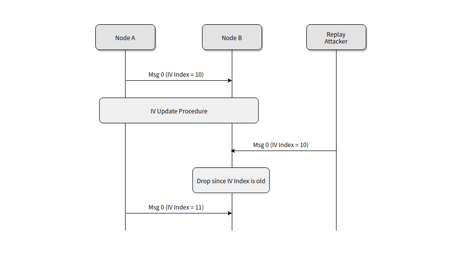
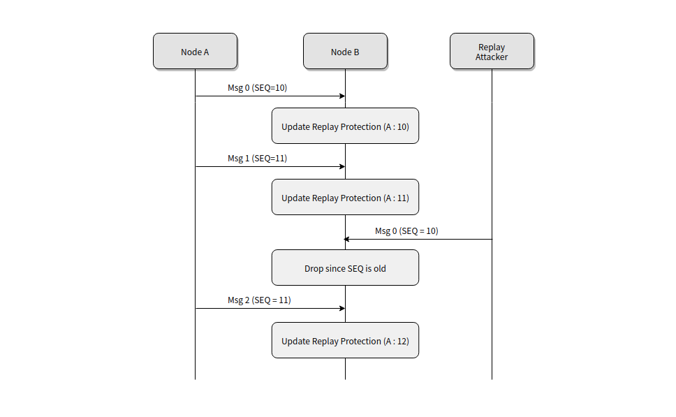

Mesh 防范重放攻击

重放攻击的基本原理就是把以前**窃听**到的数据原封不动地重新发送给接收方。

Mesh 内部使用 Source Address (SRC)、 Sequence Number (SEQ) 和 IV Index 来防范重放攻击。有两种情况会被认为是重放攻击：

1. 当前接收消息里 IV Index **小于**整个 Mesh 网络里的 IV Index 。
2. 当前从该源地址（SRC）接收消息的 SEQ **小于等于**上一次从该源地址接收消息的 SEQ 。

第一种情况比较好理解，IV Index 是一个 32-bit 的值，是整个 Mesh 网络（包括所有子网）共享的资源，也就是说，IV Index 在整个 Mesh 网络里的值是唯一的。由于 IV Index 是一个 32-bit 的数据，一个 Mesh 网络工作大约 5 万亿年后 IV Index 才会重复。因此如果 Mesh 网络里节点从相同源地址（SRC）收到了带有过期 IV Index 的消息，就认为该消息是重放攻击。如下图所示：

第二种情况稍微麻烦点，SEQ 是一个 24-bit 的值，节点每次发送 Network PDU 需要将 SEQ 值加 1，而且每个源地址（SRC）的 SEQ 值都不一样，因此需要将 <SRC, SEQ> 看成一个二元组。节点内部维护了一个该二元组的表格，记录了上一次从该源地址接收消息的 SEQ 值，例如下表：

| Source Address | Last Sequence Number |
| -------------- | -------------------- |
| 0x0001         | 0x001234             |
| 0x0002         | 0x000020             |
| 0x0003         | 0x000120             |

- 若从该源地址收到的 SEQ 值**大于**表格中记录的 SEQ 值，则认为该数据包正常，并更新表格中的 SEQ 值。
- 若从该源地址收到的 SEQ 值**小于等于**表格中记录的 SEQ 值，则认为该数据包是重放攻击，丢弃该数据包。

图书如下：

需要注意的是，SEQ 值是 24-bit 的数据，如果节点每 5 秒发送 1 条消息，大约 2.6 年后 SEQ 值会重复，这有可能会被重放攻击者利用。Mesh Spec 1.0.1 规定当 SEQ 值到达最大值 0xFFFFFF 时，触发 IV Update procedure 过程，将 IV Index 值加 1，利用新的 IV Index 值来防范重放攻击。

